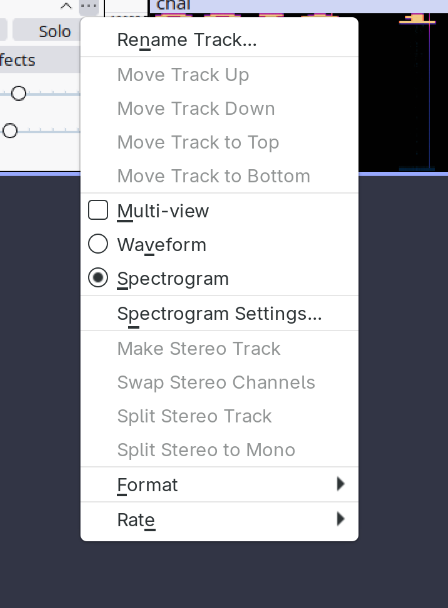
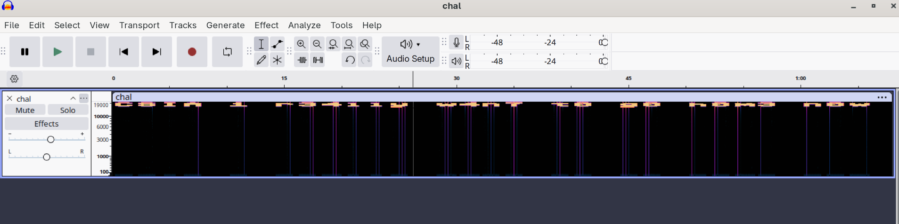

# Going home

## Description

I want to go home, but the waves. It's... it's there, but I can't hear it.

Flag format (spaces should be underscores):
CSIA{format_it_with_underscores}

Steps:
1. I downloaded the chal.wav file provided.
2. I looked into stenography and found that I can use audacity for wav files.
3. First, I listened to the file and I thought it was morse code but it wasn't.
4. I downloaded Audacity and uploaded the wav file there. 
5. I researched and found spectogram, so I set it on my file's settings and there you see, the flag.

